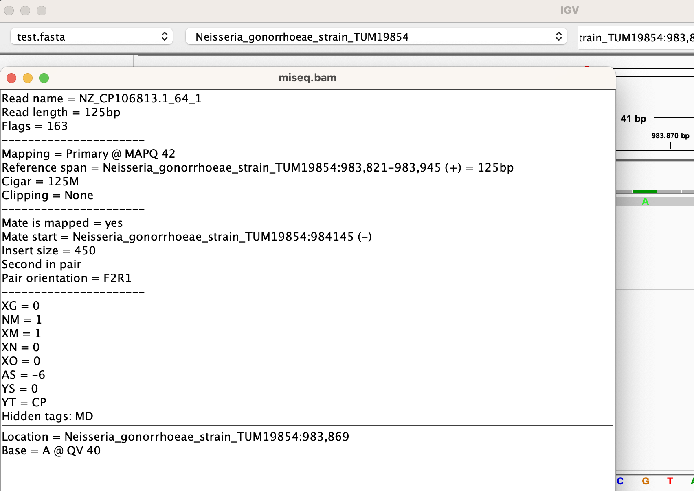

# General Information for Commands and Tutorial Material for the JHU/APL Omics Workshop

## Day 1 Setup and Installations

**Important Note**: All files can be accessed directly in the [GitHub](https://github.com/jhuapl-bio/omics_workshop) or at the website [here](https://jhuapl-bio.github.io/omics_workshop/)

### Installation of Pre-requisites

There should only be 1 requirement to install for Linux users and 2 for both Mac and Windows. 

### Option A: Windows Only. Mac and Linux need to do Option B. 

Steps to get everything:

1. Download the file. Use only **one** of the two options provided here:
   - Install Ubuntu from the [Microsoft Store](https://apps.microsoft.com/detail/9pdxgncfsczv?rtc=1&hl=en-us&gl=US)
   - If that fails then run: [install.bat](https://jhuapl-bio.github.io/omics_workshop/install.bat)
      - Run (double click) `install.bat` in your `Downloads` folder
4. Follow the prompt that opens after some time to add a username and password: Defaults are
   Username: `omics_workshop`
   Password: `omics_workshop`
   However, if you intend to use the system in the future you can set it to whatever information you want. **BE SURE TO REMEMBER THEM**
5. Download the file then open [wsl.bat](https://jhuapl-bio.github.io/omics_workshop/wsl.bat) in your downloads folder. Wait for it to complete and you are done!


### Option B: Mac or Linux

1. Open a terminal
2. Run the commands:
```
wget --no-check-certificate https://github.com/jhuapl-bio/omics_workshop/raw/main/install.sh -O install.sh && bash install.sh
```
4. Wait for the command to complete and you are done!


#### Error - Only run if `commmand not found` is encountered for Mac OS 

If you don't have `wget` on your system try to install it with `brew` 

Make sure you have `brew` by running:

```
/bin/bash -c "$(curl -fsSL https://raw.githubusercontent.com/Homebrew/install/HEAD/install.sh)"
```

Then, run:

```
brew install wget 
```


If you need additional help, see [manual steps](manual_install.MD)

### Updating at any point

If you feel that any install did not complete successfully, you can rerun `install.sh` in the appropriate directory or through `wsl.bat` and type in `y` to prompt a full reinstall OR `n` (default) to just update or install if not installed yet. 

For mac or linux, just rerun your one-line command `wget --no-check-certificate https://github.com/jhuapl-bio/omics_workshop/raw/main/install.sh -O install.sh && bash install.sh`. 

**Hint** you can specify `-f` like `bash install.sh -f` to skip the prompt for y/n on a force install. It will set it to `y` by default. 

## Workshop Material 

**Do not perform the below steps until requested during the specified day**


## Day 3 Alignment


### Short (Illumina) Reads

For paired-end, short reads we recommend Bowtie2, as it has shown to provide more efficient and accurate results over other aligners for a laptop deployment environment

#### Building an index

The first thing we have to do is make a directory of indices that allow a faster lookup of our reference during the alignment process. This is a Bowtie2 specific need. Please be aware that the time it takes to build your indices is directly related to the size of the reference FASTA file you're aligning against. 

Expected Runtime: 2 minutes

```
REFERENCE=references/test.fasta.gz
mkdir -p alignment/test_indices/
bowtie2-build $REFERENCE alignment/test_indices/test_indices
```

- `REFERENCE=references/test.fasta.gz` We assign an environmental variable for readability. You can also just write the exact path in the position for the command but for presentation purposes we are performing it this way. 
- `mkdir` Let's make the output directory for the indices
- `bowtie2-build` The primary command to build your indices
- `$REFERENCE` The environmental variable we made in the previous line that equals: `references/test.fasta.gz`
- `alignment/test_indices/test_indices` The positional output directory name

#### Running Bowtie2 to generate a BAM (alignment) file

Expected Runtime: 1 minute

Let us make sure we assign some environment variables for readability. This is not required if you want to put the file paths directly into the arguments

```

INDEX=alignment/test_indices/test_indices
READS1=fastq/miseq_reads_R1.fastq.gz
READS2=fastq/miseq_reads_R2.fastq.gz


bowtie2 \
    -x $INDEX \
    -1 $READS1 -2 $READS2 \
    | samtools sort | samtools view -b -h -o alignment/miseq.bam
```


- `-x` We made the $INDEX files in an earlier step. This allows us to have a "faster lookup" for the alignment process
- `-1` & `-2` Are the paired-end reads were aligning against. If it was single-end reads, then we would write `-U` instead.
- `| samtools view` We pipe the sort to `view` which is a subcommand that lets use either view or convert formats of our alignments. 
- `-o` Specify the output filename, in this case, the `miseq.sam` file
- `-h`  We want to include the header (metadata of the alignment)
- `-b` Convert the SAM output to BAM format (compressed SAM, can be many magnitudes smaller in size)


Your console/terminal should look something like this:

```
39007 reads; of these:
  39007 (100.00%) were paired; of these:
    37666 (96.56%) aligned concordantly 0 times
    1225 (3.14%) aligned concordantly exactly 1 time
    116 (0.30%) aligned concordantly >1 times
    ----
    37666 pairs aligned concordantly 0 times; of these:
      32862 (87.25%) aligned discordantly 1 time
    ----
    4804 pairs aligned 0 times concordantly or discordantly; of these:
      9608 mates make up the pairs; of these:
        7244 (75.40%) aligned 0 times
        606 (6.31%) aligned exactly 1 time
        1758 (18.30%) aligned >1 times
90.71% overall alignment rate

```

Here, we can see that ~90.7% of all reads aligned at some point with some other stats sprinkled in there. 


### Viewing your BAM file

In the previous steps, we piped the output of our aligners and another samtools command into a final `samtools view...` which allowed us to convert the output into a compressed version (BAM) of the standard alignment output, SAM. In order to view the BAM file, we can simply run: 


```
samtools view  alignment/miseq.bam   | head
```

- `view` Subcommand to view the content of whatever file in the position index
- `head` a command we pipe to just peak at the top of the file, which follows the `|` command as `samtools view` by default will output to stdout/stderr (your terminal).

Notice how we removed the `-b` parameter, which indicated that we wanted to convert the standard SAM output that is human-readable into the compressed BAM format. Notice how I ran `head` to only get the top 10 lines from the file by default. You can remove the `| head` (we will do this next step) to see the entire file. Be aware that alignment files are typically massive decompressed in most metagenomics samples, reaching 10's of GBs in size in some cases. 


Now, let's do something similar to the final step in the alignment pipe command because we want to make the file permanently viewable. That is, we want to remove the dependence on using `samtools view` everytime we want to look at the file. We tweak a small amount of code & instead run (to make a SAM file):

```
samtools view -h alignment/miseq.bam -o alignment/miseq.sam
```

- `-o` Specify the output filename, in this case, the `miseq.sam` file
- `view` Subcommand to view the content of whatever file in the position index
- `-h`  We want to include the header (metadata of the alignment)


### Long (ONT) Reads.

Expected Runtime: 1 minute

#### Running Minimap2 to generate a BAM (alignment) file

For single-end, long reads we recommend Minimap2, as it has shown to provide more efficient and accurate results over other aligners for a laptop deployment environment

```

READS=fastq/ont_reads.fastq.gz
REFERENCE=references/test.fasta.gz

minimap2 \
     -x map-ont \
    $REFERENCE \
    $READS \
    -L -a | samtools sort | samtools view -b -h -o alignment/ont.bam  

```

- `-x map-ont` Specifies that we want minimap2 to assume that the data is `ont` data. 
- `$REFERENCE` A few lines above, we define our environment variable: FASTA file. This is positional and pefore the read positions
- `$READS` The list of READS we want to align. In our case, it is the example ONT reads we've been looking at
- `-L` Use CIGAR ops. Unimportant for explanation but useful for downstream steps
- `-a` Output in the SAM format (standard alignment format)
- `| samtools sort` We go ahead and output the stdout from the alignment algorithm to samtools to sort on position and reference found.
- `| samtools view` We pipe the sort to `view` which is a subcommand that lets use either view or convert formats of our alignments. 
- `-o` Specify the output filename, in this case, the `miseq.sam` file
- `-h`  We want to include the header (metadata of the alignment)
- `-b` Convert the SAM output to BAM format (compressed SAM, can be many magnitudes smaller in size)

Expected command lint stdout/stderr

```
[M::mm_idx_gen::0.867*1.23] collected minimizers
[M::mm_idx_gen::1.105*1.61] sorted minimizers
[M::main::1.105*1.61] loaded/built the index for 38 target sequence(s)
[M::mm_mapopt_update::1.229*1.55] mid_occ = 31
[M::mm_idx_stat] kmer size: 15; skip: 10; is_hpc: 0; #seq: 38
[M::mm_idx_stat::1.309*1.51] distinct minimizers: 8386701 (66.12% are singletons); average occurrences: 1.514; average spacing: 5.345; total length: 67856416
[M::worker_pipeline::3.033*2.28] mapped 3000 sequences
[M::main] Version: 2.26-r1175
[M::main] CMD: minimap2 -x map-ont -L -a references/test.fasta.gz fastq/ont_reads.fastq.gz
[M::main] Real time: 3.055 sec; CPU: 6.930 sec; Peak RSS: 0.709 GB
```


## Get general Coverage Stats for your alignments

```
samtools coverage alignment/miseq.bam
```

Expected output 

```
#rname  startpos        endpos  numreads        covbases        coverage        meandepth       meanbaseq       meanmapq
Respiratory_syncytial_virus_A   1       15191   152     14824   97.5841 3.01178 32.5    42
Staphylococcus_aureus_subsp._aureus_NCTC_8325   1       2821361 11173   1859975 65.9247 1.07963 33.2    41
Neisseria_gonorrhoeae_strain_TUM19854   1       2167602 8046    1400912 64.6296 1.04874 33      39.4
Pseudomonas_aeruginosa_PAO1     1       6264404 41623   5425654 86.6109 1.99994 32.6    41.4
Bacillus_subtilis_subsp._subtilis_str._168      1       4215606 9682    2098744 49.7851 0.690362        32.6    41.3
Listeria_monocytogenes_EGD-e    1       2944528 1       124     0.0042112       4.2112e-05      40      0
Salmonella_enterica_subsp._enterica_serovar_Typhimurium_str_LT2 1       4857450 47      5659    0.116501        0.00120866      40     2.57
Escherichia_coli_str._K-12_substr_MG1655        1       4641652 36      4726    0.101817        0.00104165      39.2    7.36
Limosilactobacillus_fermentum_strain_EFEL6800   1       2068538 10      1128    0.0545313       0.000602841     40      0.1
```

See discussion for meaning of each column for coverage.

Now, do the same for the minimap2 coverage information

```
samtools coverage alignment/ont.bam

#rname  startpos        endpos  numreads        covbases        coverage        meandepth       meanbaseq       meanmapq
Staphylococcus_aureus_subsp._aureus_NCTC_8325   1       2821361 907     1629969 57.7724 0.85742 14      59.5
Pseudomonas_aeruginosa_PAO1     1       6264404 8       117273  1.87205 0.0187205       14      60
Bacillus_subtilis_subsp._subtilis_str._168      1       4215606 874     1801738 42.7397 0.555923        14      59.4
Listeria_monocytogenes_EGD-e    1       2944528 211     897089  30.4663 0.370027        14      58.4
Salmonella_enterica_subsp._enterica_serovar_Typhimurium_str_LT2 1       4857450 42      342289  7.04668 0.0738289       14      60
Escherichia_coli_str._K-12_substr_MG1655        1       4641652 134     795631  17.1411 0.189285        14      60
Limosilactobacillus_fermentum_strain_EFEL6800   1       2068538 97      514396  24.8676 0.28864 14      60
Limosilactobacillus_fermentum_strain_EFEL6800_plasmid_pLBF347   1       34793   121     34793   100     16.5382 14      59.5
Saccharomyces_cerevisiae_S288C_chromosome_I     1       230218  47      84078   36.521  0.540918        14      55.3

```


### Understanding parameter adjustments with Alignment (minimap2)

What if we, instead, wanted to constrain the quality of the mapping that took place, where we only get the BEST scores available. Let's adjust the minimum mapq (mapping quality) score to 60, which equates to 

```
READS=fastq/ont_reads.fastq.gz
REFERENCE=references/test.fasta.gz

minimap2 \
     -x map-ont \
    $REFERENCE \
    $READS \
    -L -a | samtools sort | samtools view -b -h -o alignment/ont.q60.bam -q 60  && samtools coverage alignment/ont.q60.bam
```

- `| samtools sort` We go ahead and output the stdout from the alignment algorithm to samtools to sort on position and reference found.


Expected stdout/stderr

```
[M::mm_idx_gen::0.873*1.22] collected minimizers
[M::mm_idx_gen::1.110*1.60] sorted minimizers
[M::main::1.110*1.60] loaded/built the index for 38 target sequence(s)
[M::mm_mapopt_update::1.233*1.54] mid_occ = 31
[M::mm_idx_stat] kmer size: 15; skip: 10; is_hpc: 0; #seq: 38
[M::mm_idx_stat::1.316*1.50] distinct minimizers: 8386701 (66.12% are singletons); average occurrences: 1.514; average spacing: 5.345; total length: 67856416
[M::worker_pipeline::3.046*2.27] mapped 3000 sequences
[M::main] Version: 2.26-r1175
[M::main] CMD: minimap2 -x map-ont -L -a references/test.fasta.gz fastq/ont_reads.fastq.gz
[M::main] Real time: 3.069 sec; CPU: 6.940 sec; Peak RSS: 0.736 GB
```

```
#rname  startpos        endpos  numreads        covbases        coverage        meandepth       meanbaseq       meanmapq
Staphylococcus_aureus_subsp._aureus_NCTC_8325   1       2821361 897     1623800 57.5538 0.852678        14      60
Pseudomonas_aeruginosa_PAO1     1       6264404 8       117273  1.87205 0.0187205       14      60
Bacillus_subtilis_subsp._subtilis_str._168      1       4215606 861     1788953 42.4364 0.548462        14      60
Listeria_monocytogenes_EGD-e    1       2944528 201     878599  29.8384 0.361071        14      60
Salmonella_enterica_subsp._enterica_serovar_Typhimurium_str_LT2 1       4857450 42      342289  7.04668 0.0738289       14      60
Escherichia_coli_str._K-12_substr_MG1655        1       4641652 134     795631  17.1411 0.189285        14      60
Limosilactobacillus_fermentum_strain_EFEL6800   1       2068538 97      514396  24.8676 0.28864 14      60
Limosilactobacillus_fermentum_strain_EFEL6800_plasmid_pLBF347   1       34793   120     34793   100     16.5099 14      60
Saccharomyces_cerevisiae_S288C_chromosome_I     1       230218  42      84076   36.5202 0.535249        14      60

```

Notice that only the reads with Q60 mapq have been filtered down. The number of covbases should be lower as well as meandepth and coverage. 


#### Sorting and Indexing a BAM file for quick lookups

Let's first sort and index the ONT reads

```
samtools sort -o alignment/ont.sorted.bam alignment/ont.bam \
    && mv alignment/ont.sorted.bam alignment/ont.bam \
    && samtools index alignment/ont.bam

```

- `-o` Output filename as a sorted BAM file
- `| samtools sort` We go ahead and output the stdout from the alignment algorithm to samtools to sort on position and reference found.
- `&& mv alignment/ont.sorted.bam alignment/ont.bam` We're going to go ahead and replace the new sorted bam with the old one. This is a better file, as it allows lookups to be quicker. The sorted does not harm anything as it relates to the original BAM contents. 
- `&&  samtools index alignment/ont.bam` We run a 3rd command that indexes the `bam` file for consensus purposes

And for Miseq reads (Illumina)

```
samtools sort -o alignment/miseq.sorted.bam alignment/miseq.bam \
    && mv alignment/miseq.sorted.bam alignment/miseq.bam \
    && samtools index alignment/miseq.bam
```

You should notice a `.bai` file in the new directory. This will be used for making consensus files in the future for reference-based alignments.

## Variant-calling

What if we want to take a look at what variations are in our data relative to the reference genome we used? In order to use that, we have to use another tool called `bcftools` which can not only create these variant-called files (.vcf) but also run [assembly](#reference-based-assembly)

In order to run variant analysis, we have to type and run this command for the miseq data

Unfortunately, `bcftools` needs your FASTA file to be decompressed, so let's decompress a `.gz` file (`test.fasta.gz`)!

To do this, let's run:

```
gzip -df --keep references/test.fasta.gz
```

`gzip` is used to decompress `.gz` files, which is a common format of compression in Unix, much like `.zip` is for Windows systems. All you need to know is that `.gz` means the file is compressed and not readable by human eyes. 

Next, let's use a large command to make a variant file. Don't worry, we'll break apart each piece. 

```

bcftools \
    mpileup \
    --fasta-ref references/test.fasta  \
    alignment/miseq.bam \
    | bcftools call -mv -Oz -o variants/miseq.bcf; 
```

Look at the contents of the command:

- `bcftools` is the primary suite of tools we can use to make our assembly
- `mpileup` is the subcommand of `bcftools` toolkit to extract variants using a reference
- `--fasta-ref` is the location of your local fasta file to get the variant comparison from
- `alignment/miseq.bam` our positional placement of the alignment file we made for the miseq reads
- `| bcftools call` is us piping the content of the `mpileup` command 
- `-m` multiallelic-caller
- `-v` Only show variants in our file
- `-O` Type of output. we specify `z` afterwards for compressed: 
  - `Output type: 'b' compressed BCF; 'u' uncompressed BCF; 'z' compressed VCF; 'v' uncompressed VCF [v]`
- `-o` output filename set to `variants/miseq.bcf`

Since we need to index things for a downstream step from our vcf we then need to run:

```
bcftools index -f variants/miseq.bcf; 
```

- `index` is a subcommand to index the vcf file
- `variants/miseq.bcf; ` positional input for the vcf file. An index file will be made in the same directory with the `.csi` extension.


Congrats! You made your first variant-calling file. Let's take a look at the contents:

**Hint** the output format is compressed (`.bcf` extension)! That means we need to run `gzip` to view it. If we run `-d` (decompress) and `-c` the output will go to your stdout/stderr and only in your terminal contents. It wont make a file but allows us to quickly view things if we pipe it to `less`

```
gzip -dc variants/miseq.bcf  | less
```
- `-d` Decompress the bcf file (compressed vcf filename)
- `-c` Put the contents to the terminal rather than make a new file

To See contents:

```
#fileformat=VCFv4.2
##FILTER=<ID=PASS,Description="All filters passed">
##bcftoolsVersion=1.18+htslib-1.19.1
##bcftoolsCommand=mpileup --fasta-ref references/test.fasta alignment/miseq.bam
##reference=file://references/test.fasta
....
```
Near the top (we opened it in `less`, use `q` to quit) there is a lot of metadata. Unimportant, for the most part to use, but to downstream steps.

Let's use the down-arrows on our keyboard to scroll to the actual contents of the variant analysis, which looks like:

```
...
#CHROM  POS     ID      REF     ALT     QUAL    FILTER  INFO    FORMAT  alignment/miseq.bam
Staphylococcus_aureus_subsp._aureus_NCTC_8325   4580    .       G       A       10.7923 .       DP=1;SGB=-0.379885;MQ0F=0;AC=2;AN
=2;DP4=0,0,0,1;MQ=42    GT:PL   1/1:40,3,0
Staphylococcus_aureus_subsp._aureus_NCTC_8325   5229    .       C       A       10.7923 .       DP=1;SGB=-0.379885;MQ0F=0;AC=2;AN
=2;DP4=0,0,1,0;MQ=42    GT:PL   1/1:40,3,0
Staphylococcus_aureus_subsp._aureus_NCTC_8325   11300   .       G       A       10.7923 .       DP=1;SGB=-0.379885;MQ0F=0;AC=2;AN
=2;DP4=0,0,1,0;MQ=42    GT:PL   1/1:40,3,0
...
```

To search quickly for a piece of text, you can type `/` like if we wanted to search for position `2584777` with `/2584777`

You can see here that the `REF` and `ALT` BOTH have values, compared to other lines where **just** `REF` was present. If there is **no** `ALT` there is no variant/SNP. But if there is one then there is a variant called at that position for that reference!


## Reference-based Assembly

Now that we've created a BAM file and indexed it, we need to make a consensus (FASTA) file from this information. 


```
cat references/test.fasta | bcftools \
   consensus \
   variants/miseq.bcf > alignment/miseq.consensus.fna
```

- `cat references/test.fasta` we first output the contents of the fasta file into our terminal
- `| bcftools ` we pipe the contents to bcftools 
- `consensus` subcommand of `bcftools` to make a consensus from the upcoming information
-  `variants/miseq.bcf` positional input to set a `.vcf` file which contains all the variants that will be mapped, position-wise, to the reference FASTA.
- `> alignment/miseq.consensus.fna` Redirect the output (which would normally be on the terminal) into the consensus file

You'll get an output that states something like: `Applied <x number of> variants`

You've now made a consensus FASTA file that can be viewed in IGV!

```
Neisseria_gonorrhoeae_strain_TUM19854   983869  .       G       A       10.7923 .       DP=1;SGB=-0.379885;MQ0F=0;AC=2;AN=2;DP4=0,0,1,0;MQ=42    GT:PL   1/1:40,3,0
```
For example, let's look at position 983869 of Neisseria gonorrhoeae in the file ^ and in IGV




## Day 4 Metagenomics for agnostic classifications

### Defining our command using Kraken2


Type:

First, let's stage everything by decompressing our database tarball with tar and also make a directory to place our output files

```
mkdir -p metagenomics
tar -k -C databases -xvzf databases/test_metagenome.tar.gz
```

Remember these parameters for tar. They aren't important to [kraken2](https://github.com/DerrickWood/kraken2/wiki) but are useful when working with decompressing a tarball

- `-C` Change to directory to perform decompressing. This is where the files will live after decompression has taken place
- `-k` Keep the original tarball. Omit this in most cases if you dont want to store as much as soon as you've decompressed.
- `-x` Extract - used for decompressing
- `-v` verbose output. otherwise, it is quiet on the stdout/stderr
- `-z` The tar is also compressed because it ends with `.gz`
- `-f` Specify the filename of the tarball (compressed or otherwise)


```
kraken2 --report metagenomics/miseq.k2.report  --paired --out metagenomics/miseq.k2.out --db databases/test_metagenome fastq/miseq_reads_R1.fastq.gz fastq/miseq_reads_R2.fastq.gz
```

- `--report` the primary report file (see contents below) that contains the hierarchical distribution of organism abundance in our sample
- `--out` the read-by-read classification file. This can be very large depending on the amount of reads you classify
- `--db` the kraken2 database that contains the `k2d` index files necessary to perform classification. 
- `--paired` indicating that we are classifying a set of paired-end read files
- `fastq/miseq_reads_R1.fastq.gz fastq/miseq_reads_R2.fastq.gz` The positional read names (can be compressed or not) for our example. This example, we use paired-end reads. 


You will see output like 

```

Loading database information... done.
78014 sequences (21.72 Mbp) processed in 1.766s (2650.3 Kseq/m, 737.94 Mbp/m).
  77724 sequences classified (99.63%)
  290 sequences unclassified (0.37%)
```

This will make a kraken2 report and outfile in the `metagenomics` directory. Let's view the report file with `cat` like so

```
cat metagenomics/miseq.k2.report 
```

Which will have output like

```
 6.46  5040    5040    U       0       unclassified
 93.54  72974   0       R       1       root
 93.34  72822   0       R1      131567    cellular organisms
 93.34  72822   2       D       2           Bacteria
 64.00  49926   0       P       1224          Pseudomonadota
 53.67  41871   1       C       1236            Gammaproteobacteria
 53.36  41631   0       O       72274             Pseudomonadales
 53.36  41631   0       F       135621              Pseudomonadaceae
 53.36  41631   0       G       286                   Pseudomonas
 53.36  41631   0       G1      136841                  Pseudomonas aeruginosa group
 53.36  41631   0       S       287                       Pseudomonas aeruginosa
 53.36  41631   41631   S1      1279007                     Pseudomonas aeruginosa PA1
...
 14.34  11185   11185   S1      93061                       Staphylococcus aureus subsp. aureus NCTC 8325
...
  0.15  114     114     S3      99287                         Salmonella enterica subsp. enterica serovar Typhimurium str. LT2
...
  0.12  95      95      S2      511145                      Escherichia coli str. K-12 substr. MG1655

...
 12.38  9655    9655    S2      224308                          Bacillus subtilis subsp. subtilis str. 168
...
...
  0.01  7       7       S       1613                      Limosilactobacillus fermentum
 ...
  0.19  152     152     S2      12814                           Respiratory syncytial virus
```

Notice the columns which are unanmed. I've truncated much of the output for readability. The columns are:

1. Percentage of fragments covered by the clade rooted at this taxon
2. Number of fragments covered by the clade rooted at this taxon
3. Number of fragments assigned directly to this taxon
4. A rank code, indicating (U)nclassified, (R)oot, (D)omain, (K)ingdom,
   (P)hylum, (C)lass, (O)rder, (F)amily, (G)enus, or (S)pecies.
   Taxa that are not at any of these 10 ranks have a rank code that is
   formed by using the rank code of the closest ancestor rank with
   a number indicating the distance from that rank.  E.g., "G2" is a
   rank code indicating a taxon is between genus and species and the
   grandparent taxon is at the genus rank.
5. NCBI taxonomic ID number
6. Indented scientific name


Let's now do the same for our ONT data

```
kraken2 --report metagenomics/ont.k2.report --out metagenomics/ont.k2.out --db databases/test_metagenome fastq/ont_reads.fastq.gz
```

Be aware that we've removed `--paired` to indicate that we are classifying single-end reads. 

See [docs](https://github.com/DerrickWood/kraken2/blob/master/docs/MANUAL.markdown) for more detailed information on kraken2

Lastly, do you notice any organisms missing from the alignment coverage stats?


### Make a Krona Plot

Make sure you've updated the taxonomy before you do this. This should've occurred when you installed everything with `install.bat` and `install.sh`. If you haven't done so, make sure to run within WSL2:


#### Making the Krona Plot

Next, we need to use the NCBI taxonomy mapping for parent-child relationships and make the report. Let's make it in the `metagenomics` folder like so. This requires a taxonomy.tab file to be present. You can get it [here]() or by installing it from the command line like: 

#### Illumina Reads

```
ktImportTaxonomy -t 5 -m 3 -o metagenomics/miseq.krona.html metagenomics/miseq.k2.report 
```
- `ktImportTaxonomy`
- `-t` The taxonomic ID column
- `-m` The abundance (magnitude column number in our k2 report file)
- `-o` The output html file
- `metagenomics/miseq.k2.report` The positional input filename from the kraken2 results we made earlier (report file)

Remember, the content of the k2 report looks like

```
Abundance classified_at_clade classified_at_taxon_only rank  taxid organismName
14.34  11185   11185   S1      93061                       Staphylococcus aureus subsp. aureus NCTC 8325
```

So we want to set the magnitude to `-m 3` since Krona wants to get the size for each level rather than the aggregate across it AND all children to make the hierarchy we will sow in a moment. 


Now, open up the `metagenomics/miseq.krona.html` by double-clicking it. It should take you to a web-browser with the interactive plot.

#### ONT Reads

```
ktImportTaxonomy -t 5 -m 3 -o metagenomics/ont.krona.html metagenomics/ont.k2.report 
```

IF you don't have the taxonomy.tab file, you can get it [here](https://github.com/jhuapl-bio/datasets/blob/main/databases/ncbi/taxonomy.tab.gz) or installing with the command:

```
mkdir -p  ~/omics_workshop/downloads/ \
    && wget https://github.com/jhuapl-bio/datasets/raw/main/databases/ncbi/taxonomy.tab.gz \
    -O ~/omics_workshop/downloads/taxonomy.tab.gz \
    && gzip -f -d ~/omics_workshop/downloads/taxonomy.tab.gz  && \
    mv ~/omics_workshop/downloads/taxonomy.tab $(dirname $(which ktImportTaxonomy))/../opt/krona/taxonomy/
```

If you ran the `install.sh` script you should already have it in the correct location

## Downloading and Installing R and R studio

Adapted from [https://rstudioeducation.github.io/hopr/starting.html](https://rstudioeducation.github.io/hopr/starting.html)

To get started with R, you need to acquire your own copy. This appendix will show you how to download R as well as RStudio, a software application that makes R easier to use. You’ll go from downloading R to opening your first R session.
Both R and RStudio are free and easy to download.

### How to download and install R 

R is maintained by an international team of developers who make the language available through the web page of [The Comprehensive R Archive Network](https://cran.r-project.org/). The top of the web page provides three links for downloading R. Follow the link that describes your operating system: Windows, Mac, or Linux. 

#### Windows 

To install R on Windows, click **The Comprehensive R Archive Network link above**, then click the “Download R for Windows” link. Then click the “base” link. Next, click the first link at the top of the new page. This link should say something like “Download R 4.3.3 for Windows,” or the most current version of R that is shown. The link downloads an installer program, which installs the most up-to-date version of R for Windows. Run this program and step through the installation wizard that appears. The wizard will install R into your program files folders and place a shortcut in your Start menu. Note that you’ll need to have all of the appropriate administration privileges to install new software on your machine.

#### Mac 

To install R on a Mac, click the “**Download R for Mac**” link. Next, click on the R 4.3.3 package link (or the package link for the most current release of R). An installer will download to guide you through the installation process, which is very easy. The installer lets you customize your installation, but the defaults will be suitable for most users. I’ve never found a reason to change them. If your computer requires a password before installing new programs, you’ll need it here.

**Binaries Versus Source**

R can be installed from precompiled binaries or built from source on any operating system. For Windows and Mac machines, installing R from binaries is extremely easy. The binary comes preloaded in its own installer. Although you can build R from source on these platforms, the process is much more complicated and won’t provide much benefit for most users. For Linux systems, the opposite is true. Precompiled binaries can be found for some systems, but it is much more common to build R from source files when installing on Linux. The download pages on [CRAN’s website](https://cran.r-project.org/) provide information about building R from source for the Windows, Mac, and Linux platforms.

#### Linux 

R comes preinstalled on many Linux systems, but you’ll want the newest version of R if yours is out of date. The [CRAN website](https://cran.r-project.org/) provides files to build R from source on Debian, Redhat, SUSE, and Ubuntu systems under the link “Download R for Linux.” Click the link and then follow the directory trail to the version of Linux you wish to install on. The exact installation procedure will vary depending on the Linux system you use. CRAN guides the process by grouping each set of source files with documentation or README files that explain how to install on your system.

**32-bit Versus 64-bit**

R comes in both 32-bit and 64-bit versions. Which should you use? 
If your operating system doesn’t support 64-bit programs, or your RAM is less than 4 GB, 32-bit R is for you. The Windows and Mac installers will automatically install both versions if your system supports 64-bit R.

### Using R 

R isn’t a program that you can open and start using, like Microsoft Word or Internet Explorer. Instead, R is a computer language, like C, C++, or UNIX. You use R by writing commands in the R language and asking your computer to interpret them. Now almost everyone uses R with an application called RStudio, and we will be installing this as well.
R and UNIX

You can still run R in a UNIX or BASH window by typing the command:
R

which opens an R interpreter. You can then do your work and close the interpreter by running q() when you are finished.

### RStudio

RStudio is an application like Microsoft Word—except that instead of helping you write in English, RStudio helps you write in R. I use RStudio because it makes using R much easier. Also, the RStudio interface looks the same for Windows, Mac OS, and Linux. That will help when we begin to use R.

You can [download RStudio](https://posit.co/products/open-source/rstudio/) for free. Navigate to the link given, and then just click the “Download RStudio” button and follow the simple instructions that follow. Once you’ve installed RStudio, you can open it like any other program on your computer—usually by clicking an icon on your desktop.

Even if you use RStudio, you’ll still need to download R to your computer. RStudio helps you use the version of R that lives on your computer, but it doesn’t come with a version of R on its own.

### Installing packages in R studio

Next we will install a couple of packages to get us started and going for the workshop. To install a package, open R studio and navigate to the console, there you can type 

```
install.packages()
```

where the package name you want to install, appears inside the parenthesis. There will be three packages we will need to install. The first two are tidyverse, and BiocManager. Go ahead, and type these into the console as they are shown below: 

```
install.packages("tidyverse")
install.packages("BiocManager")
```
You might be asked "Do you want to install from sources the packages which need compilation?" and while either option is ok, let's say **no** for our purposes. 

You may also be asked if you want to "Update all/some/none?" of the package dependencies. Generally, it's preferred to say yes, however for install and the workshop, we will be saying **no** and it will be ok.

It's ok if they take a couple of minutes to install as there are several packages wrapped into these bundles so we can have all the functionality we need. Once you have both packages installed, we will install the third package a different way. Type:

```
library("BiocManager")
BiocManager::install("mia")
```
This package is different because it is hosted at a different location. We will be using data from this package in the workshop. 

## Phylogenetics software

Data for phylogenetic exercises and software for Windows, macOS, and Linux machines can be found [here](https://phylodynamics.github.io/).


