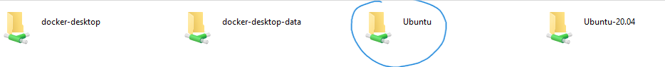
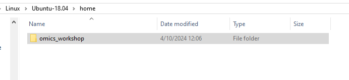

# General Information for Commands and Tutorial Material for the JHU/APL Omics Workshop

## Setup 

### Installation of Pre-requisites

There should only be 1 requirement to install for Linux users and 2 for both Mac and Windows. 

#### Windows Only - WSL2

Make sure that WSL2 is installed. In most current iterations of Windows 10/11, this should already be available. If not, run these steps:

Prerequisites: None

1. Open Windows Powershell and type `wsl --version`

If you have something appear you can skip this step, otherwise follow the instructions [here](https://docs.microsoft.com/en-us/windows/wsl/install-win10#step-4---download-the-linux-kernel-update-package)

2. `wsl --install -d ubuntu`
3. Go Back to powershell and type: `wsl.exe --set-default-version 2`

You may need to restart your machine after installing

:warning: please be aware that things in your `C:` drive will be referred to as `mnt/c/`. So, for instance if I want to put something in my `Documents` folder I would need to do `cp test.txt /mnt/c/Users/$USER/Documents/test.txt`. Make sure you select the right value of $USER in that path example. If you're unsure, simply check the username in Windows10 OR you can hit `tab` after `/mnt/c/Users/` and you should see things autopopulate`

Otherwise, if you want to view things through the File Explorer you can do so by following these steps:

##### Viewing or adding to your WSL from Windows Explorer

On the left-hand side, you should see the Linux logo in the quick search, near the bottom. Open Windows Explorer (Folder icon) on your Windows 10/11 machine first.


Make sure to select the Distro name. In my case (and yours) it is likely `Ubuntu`


Select `/home/`


Select the username. There is likely only a single directory within here. In my case, it is merribb1



You're now in the `$HOME` of your WSL2 terminal! feel free to browse around. We will access this this way when doing TaxTriage (see further down)


#### All Platforms

If you already have conda install you can skip this step.

1. Open WSL2 (Windows) or your local terminal. If in WSL2, you should open to your `$HOME` directory
2. [Miniconda3](https://docs.anaconda.com/free/miniconda/index.html) - Follow the steps here. Make sure to pick your operating system (Mac (arm/amd64), WSL2/Linux)

YOU WILL NOT SELECT WINDOWS FOR A WINDOWS MACHINE. You must select [Linux](https://repo.anaconda.com/miniconda/Miniconda3-latest-Linux-x86_64.sh) within your WSL2 terminal

3. Run the below commands to install 
   
```
mkdir -p ~/miniconda3
curl https://repo.anaconda.com/miniconda/Miniconda3-latest-MacOSX-arm64.sh -o ~/miniconda3/miniconda.sh
bash ~/miniconda3/miniconda.sh -b -u -p ~/miniconda3
rm -rf ~/miniconda3/miniconda.sh

```


#### Mac Only (after installing Conda). Skip if not using a Mac M1/2

If you use x86 architecture processors for Mac, you can skip this step. Otherwise, newer models use the M1/2 chip and require you to setup rosetta and an x86 environment to run things like conda. If you have a M1/2 Mac and have already done this process (setting up conda x86 env) you can skip this step as well.

1. Open a terminal
2. Type (you can copy this command)

```
CONDA_SUBDIR=osx-64 conda create -y -n omics_workshop python   
conda activate omics_workshop
python -c "import platform;print(platform.machine())"
conda config --env --set subdir osx-64  
```

Make sure that whenever you want to run x86 commands i.e. commands that can ONLY run within an x86 environment you must run `conda activate omics_workshop` (or whatever env name of choice you want) or it won't work. Be aware that this environment will only be used for the tutorial portions of the workshop for Mac M1/2 chips only!

Now, move onto the next step, skipping the first step. 

Resources:

1. [Issue on setting up x86 environment](https://github.com/conda-forge/miniforge/issues/165#issuecomment-860233092)

#### Packages

```
conda create -y -n omics_workshop python
conda activate omics_workshop
conda install -y -c bioconda kraken2 minimap2 bowtie2 fastqc samtools bcftools
```

## Alignment

### Short (Illumina) Reads

For paired-end, short reads we recommend Bowtie2, as it has shown to provide more efficient and accurate results over other aligners for a laptop deployment environment

#### Building an index

Expected Runtime: 2 minutes

```

REFERENCE=references/test.fasta.gz
mkdir -p alignment/test_indices
bowtie2-build $REFERENCE alignment/test_indices

```


#### Running Bowtie2 to generate a BAM (alignment) file

Expected Runtime: 1 minute

Let us make sure we assign some environment variables for readability. This is not required if you want to put the file paths directly into the arguments

```

INDEX=alignment/test_indices
READS1=fastq/ill_R1.fastq.gz
READS2=fastq/ill_R2.fastq.gz


bowtie2 \
    -x $INDEX \
    -1 $READS1 -2 $READS2 \
    2> shortreads.bowtie2.log \
    | samtools sort | samtools view -b -h -o alignment/ill.bam

```


### Long (ONT) Reads.

Expected Runtime: 1 minute

#### Running Minimap2 to generate a BAM (alignment) file

For single-end, long reads we recommend Minimap2, as it has shown to provide more efficient and accurate results over other aligners for a laptop deployment environment

```

READS=fastq/ont_reads.fastq.gz
REFERENCE=references/test.fasta.gz

minimap2 \
     -x map-ont \
    $REFERENCE \
    $READS \
    -L -a | samtools sort | samtools view -b -h -o alignment/ont.bam  

```

Expected command lint stdout/stderr

```
[M::mm_idx_gen::0.867*1.23] collected minimizers
[M::mm_idx_gen::1.105*1.61] sorted minimizers
[M::main::1.105*1.61] loaded/built the index for 38 target sequence(s)
[M::mm_mapopt_update::1.229*1.55] mid_occ = 31
[M::mm_idx_stat] kmer size: 15; skip: 10; is_hpc: 0; #seq: 38
[M::mm_idx_stat::1.309*1.51] distinct minimizers: 8386701 (66.12% are singletons); average occurrences: 1.514; average spacing: 5.345; total length: 67856416
[M::worker_pipeline::3.033*2.28] mapped 3000 sequences
[M::main] Version: 2.26-r1175
[M::main] CMD: minimap2 -x map-ont -L -a references/test.fasta.gz fastq/ont_reads.fastq.gz
[M::main] Real time: 3.055 sec; CPU: 6.930 sec; Peak RSS: 0.709 GB
```


## Get general Coverage Stats for your alignments

```
samtools coverage alignment/ill.bam
```

Expected output 

```
#rname  startpos        endpos  numreads        covbases        coverage        meandepth       meanbaseq       meanmapq
Metabacillus_litoralis_strain_NCTR108   1       5327848 1       1108    0.0207964       0.000207964     13.9    40
Staphylococcus_aureus_strain_NAS_AN_115 1       2734925 22      16638   0.608353        0.00629158      14      0.0909
Bacillus_subtilis_subsp._subtilis_str_168       1       4215606 873     1801622 42.737  0.555766        14      59.4
Escherichia_coli_str._K-12_substr._MG1655       1       4641652 134     795631  17.1411 0.189285        14      60
```


### Understanding parameter adjustments with Alignment (minimap2)

What if we, instead, wanted to constrain the quality of the mapping that took place, where we only get the BEST scores available. Let's adjust the minimum mapq (mapping quality) score to 60, which equates to 

```
READS=fastq/ont_reads.fastq.gz
REFERENCE=references/test.fasta.gz

minimap2 \
     -x map-ont \
    $REFERENCE \
    $READS \
    -L -a | samtools sort | samtools view -b -h -o alignment/ont.bam -q 60  
```

Expected stdout/stderr

```
[M::mm_idx_gen::0.873*1.22] collected minimizers
[M::mm_idx_gen::1.110*1.60] sorted minimizers
[M::main::1.110*1.60] loaded/built the index for 38 target sequence(s)
[M::mm_mapopt_update::1.233*1.54] mid_occ = 31
[M::mm_idx_stat] kmer size: 15; skip: 10; is_hpc: 0; #seq: 38
[M::mm_idx_stat::1.316*1.50] distinct minimizers: 8386701 (66.12% are singletons); average occurrences: 1.514; average spacing: 5.345; total length: 67856416
[M::worker_pipeline::3.046*2.27] mapped 3000 sequences
[M::main] Version: 2.26-r1175
[M::main] CMD: minimap2 -x map-ont -L -a references/test.fasta.gz fastq/ont_reads.fastq.gz
[M::main] Real time: 3.069 sec; CPU: 6.940 sec; Peak RSS: 0.736 GB
```


