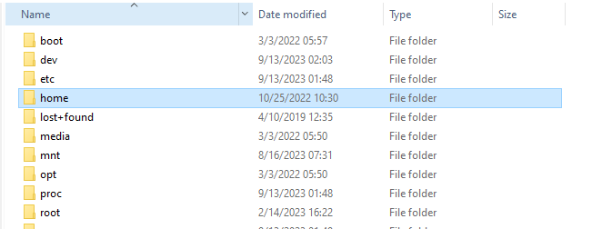

# General Information for Commands and Tutorial Material for the JHU/APL Omics Workshop

## Setup 

### Installation of Pre-requisites

There should only be 1 requirement to install for Linux users and 2 for both Mac and Windows. 

#### Windows Only - WSL2

Make sure that WSL2 is installed. In most current iterations of Windows 10/11, this should already be available. If not, run these steps:

Prerequisites: None

1. Open Windows Powershell and type `wsl --version`

If you have something appear you can skip this step, otherwise follow the instructions [here](https://docs.microsoft.com/en-us/windows/wsl/install-win10#step-4---download-the-linux-kernel-update-package)

2. `wsl --install -d ubuntu`
3. Go Back to powershell and type: `wsl.exe --set-default-version 2`

You may need to restart your machine after installing

:warning: please be aware that things in your `C:` drive will be referred to as `mnt/c/`. So, for instance if I want to put something in my `Documents` folder I would need to do `cp test.txt /mnt/c/Users/$USER/Documents/test.txt`. Make sure you select the right value of $USER in that path example. If you're unsure, simply check the username in Windows10 OR you can hit `tab` after `/mnt/c/Users/` and you should see things autopopulate`

Otherwise, if you want to view things through the File Explorer you can do so by following these steps:

##### Viewing or adding to your WSL from Windows Explorer

On the left-hand side, you should see the Linux logo in the quick search, near the bottom. Open Windows Explorer (Folder icon) on your Windows 10/11 machine first.


Make sure to select the Distro name. In my case (and yours) it is likely `Ubuntu`


Select `/home/`



Select the username. There is likely only a single directory within here. In my case, it is merribb1


You're now in the `$HOME` of your WSL2 terminal! feel free to browse around. We will access this this way when doing TaxTriage (see further down)


#### All Platforms

If you already have conda install you can skip this step.

1. Open WSL2 (Windows) or your local terminal. If in WSL2, you should open to your `$HOME` directory
2. [Miniconda3](https://docs.anaconda.com/free/miniconda/index.html) - Follow the steps here. Make sure to pick your operating system (Mac (arm/amd64), WSL2/Linux)

YOU WILL NOT SELECT WINDOWS FOR A WINDOWS MACHINE. You must select [Linux](https://repo.anaconda.com/miniconda/Miniconda3-latest-Linux-x86_64.sh) within your WSL2 terminal

3. Run the below commands to install 
   
```
mkdir -p ~/miniconda3
curl https://repo.anaconda.com/miniconda/Miniconda3-latest-MacOSX-arm64.sh -o ~/miniconda3/miniconda.sh
bash ~/miniconda3/miniconda.sh -b -u -p ~/miniconda3
rm -rf ~/miniconda3/miniconda.sh

```


#### Mac Only (after installing Conda). Skip if not using a Mac M1/2

If you use x86 architecture processors for Mac, you can skip this step. Otherwise, newer models use the M1/2 chip and require you to setup rosetta and an x86 environment to run things like conda. If you have a M1/2 Mac and have already done this process (setting up conda x86 env) you can skip this step as well.

1. Open a terminal
2. Type (you can copy this command)

```
export CONDA_SUBDIR=osx-64
```

You only need to run this if you have a Mac M1/2 and before you run the following installation step (Packages).

Resources:

1. [Issue on setting up x86 environment](https://github.com/conda-forge/miniforge/issues/165#issuecomment-860233092)

#### Packages

```
conda create -y -n omics_workshop bowtie2 minimap2 kraken2 krona fastqc samtools bcftools python
conda activate omics_workshop
```

Congratulations, you've completed the required installation steps for running things from the command line

## Alignment

### Short (Illumina) Reads

For paired-end, short reads we recommend Bowtie2, as it has shown to provide more efficient and accurate results over other aligners for a laptop deployment environment

#### Building an index

Expected Runtime: 2 minutes

```

REFERENCE=references/test.fasta.gz
rm -r alignment/test_indices
mkdir -p alignment/test_indices/
bowtie2-build $REFERENCE alignment/test_indices/test_indices

```


#### Running Bowtie2 to generate a BAM (alignment) file

Expected Runtime: 1 minute

Let us make sure we assign some environment variables for readability. This is not required if you want to put the file paths directly into the arguments

```

INDEX=alignment/test_indices/test_indices
READS1=fastq/miseq_reads_R1.fastq.gz
READS2=fastq/miseq_reads_R2.fastq.gz


bowtie2 \
    -x $INDEX \
    -1 $READS1 -2 $READS2 \
    2> shortreads.bowtie2.log \
    | samtools sort | samtools view -b -h -o alignment/miseq.bam

```


### Long (ONT) Reads.

Expected Runtime: 1 minute

#### Running Minimap2 to generate a BAM (alignment) file

For single-end, long reads we recommend Minimap2, as it has shown to provide more efficient and accurate results over other aligners for a laptop deployment environment

```

READS=fastq/ont_reads.fastq.gz
REFERENCE=references/test.fasta.gz

minimap2 \
     -x map-ont \
    $REFERENCE \
    $READS \
    -L -a | samtools sort | samtools view -b -h -o alignment/ont.bam  

```

Expected command lint stdout/stderr

```
[M::mm_idx_gen::0.867*1.23] collected minimizers
[M::mm_idx_gen::1.105*1.61] sorted minimizers
[M::main::1.105*1.61] loaded/built the index for 38 target sequence(s)
[M::mm_mapopt_update::1.229*1.55] mid_occ = 31
[M::mm_idx_stat] kmer size: 15; skip: 10; is_hpc: 0; #seq: 38
[M::mm_idx_stat::1.309*1.51] distinct minimizers: 8386701 (66.12% are singletons); average occurrences: 1.514; average spacing: 5.345; total length: 67856416
[M::worker_pipeline::3.033*2.28] mapped 3000 sequences
[M::main] Version: 2.26-r1175
[M::main] CMD: minimap2 -x map-ont -L -a references/test.fasta.gz fastq/ont_reads.fastq.gz
[M::main] Real time: 3.055 sec; CPU: 6.930 sec; Peak RSS: 0.709 GB
```


## Get general Coverage Stats for your alignments

```
samtools coverage alignment/miseq.bam
```

Expected output 

```
#rname  startpos        endpos  numreads        covbases        coverage        meandepth       meanbaseq       meanmapq
Respiratory_syncytial_virus_A   1       15191   152     14824   97.5841 3.01178 32.5    42
Staphylococcus_aureus_subsp._aureus_NCTC_8325   1       2821361 11173   1859975 65.9247 1.07963 33.2    41
Neisseria_gonorrhoeae_strain_TUM19854   1       2167602 8046    1400912 64.6296 1.04874 33      39.4
Pseudomonas_aeruginosa_PAO1     1       6264404 41623   5425654 86.6109 1.99994 32.6    41.4
Bacillus_subtilis_subsp._subtilis_str._168      1       4215606 9682    2098744 49.7851 0.690362        32.6    41.3
Listeria_monocytogenes_EGD-e    1       2944528 1       124     0.0042112       4.2112e-05      40      0
Salmonella_enterica_subsp._enterica_serovar_Typhimurium_str_LT2 1       4857450 47      5659    0.116501        0.00120866      40     2.57
Escherichia_coli_str._K-12_substr_MG1655        1       4641652 36      4726    0.101817        0.00104165      39.2    7.36
Limosilactobacillus_fermentum_strain_EFEL6800   1       2068538 10      1128    0.0545313       0.000602841     40      0.1
```

See discussion for meaning of each column for coverage.

Now, do the same for the minimap2 coverage information

```
samtools coverage alignment/ont.bam

#rname  startpos        endpos  numreads        covbases        coverage        meandepth       meanbaseq       meanmapq
Staphylococcus_aureus_subsp._aureus_NCTC_8325   1       2821361 907     1629969 57.7724 0.85742 14      59.5
Pseudomonas_aeruginosa_PAO1     1       6264404 8       117273  1.87205 0.0187205       14      60
Bacillus_subtilis_subsp._subtilis_str._168      1       4215606 874     1801738 42.7397 0.555923        14      59.4
Listeria_monocytogenes_EGD-e    1       2944528 211     897089  30.4663 0.370027        14      58.4
Salmonella_enterica_subsp._enterica_serovar_Typhimurium_str_LT2 1       4857450 42      342289  7.04668 0.0738289       14      60
Escherichia_coli_str._K-12_substr_MG1655        1       4641652 134     795631  17.1411 0.189285        14      60
Limosilactobacillus_fermentum_strain_EFEL6800   1       2068538 97      514396  24.8676 0.28864 14      60
Limosilactobacillus_fermentum_strain_EFEL6800_plasmid_pLBF347   1       34793   121     34793   100     16.5382 14      59.5
Saccharomyces_cerevisiae_S288C_chromosome_I     1       230218  47      84078   36.521  0.540918        14      55.3

```


### Understanding parameter adjustments with Alignment (minimap2)

What if we, instead, wanted to constrain the quality of the mapping that took place, where we only get the BEST scores available. Let's adjust the minimum mapq (mapping quality) score to 60, which equates to 

```
READS=fastq/ont_reads.fastq.gz
REFERENCE=references/test.fasta.gz

minimap2 \
     -x map-ont \
    $REFERENCE \
    $READS \
    -L -a | samtools sort | samtools view -b -h -o alignment/ont.q60.bam -q 60  && samtools coverage alignment/ont.q60.bam
```

Expected stdout/stderr

```
[M::mm_idx_gen::0.873*1.22] collected minimizers
[M::mm_idx_gen::1.110*1.60] sorted minimizers
[M::main::1.110*1.60] loaded/built the index for 38 target sequence(s)
[M::mm_mapopt_update::1.233*1.54] mid_occ = 31
[M::mm_idx_stat] kmer size: 15; skip: 10; is_hpc: 0; #seq: 38
[M::mm_idx_stat::1.316*1.50] distinct minimizers: 8386701 (66.12% are singletons); average occurrences: 1.514; average spacing: 5.345; total length: 67856416
[M::worker_pipeline::3.046*2.27] mapped 3000 sequences
[M::main] Version: 2.26-r1175
[M::main] CMD: minimap2 -x map-ont -L -a references/test.fasta.gz fastq/ont_reads.fastq.gz
[M::main] Real time: 3.069 sec; CPU: 6.940 sec; Peak RSS: 0.736 GB
```

```
#rname  startpos        endpos  numreads        covbases        coverage        meandepth       meanbaseq       meanmapq
Staphylococcus_aureus_subsp._aureus_NCTC_8325   1       2821361 897     1623800 57.5538 0.852678        14      60
Pseudomonas_aeruginosa_PAO1     1       6264404 8       117273  1.87205 0.0187205       14      60
Bacillus_subtilis_subsp._subtilis_str._168      1       4215606 861     1788953 42.4364 0.548462        14      60
Listeria_monocytogenes_EGD-e    1       2944528 201     878599  29.8384 0.361071        14      60
Salmonella_enterica_subsp._enterica_serovar_Typhimurium_str_LT2 1       4857450 42      342289  7.04668 0.0738289       14      60
Escherichia_coli_str._K-12_substr_MG1655        1       4641652 134     795631  17.1411 0.189285        14      60
Limosilactobacillus_fermentum_strain_EFEL6800   1       2068538 97      514396  24.8676 0.28864 14      60
Limosilactobacillus_fermentum_strain_EFEL6800_plasmid_pLBF347   1       34793   120     34793   100     16.5099 14      60
Saccharomyces_cerevisiae_S288C_chromosome_I     1       230218  42      84076   36.5202 0.535249        14      60

```

Notice that only the reads with Q60 mapq have been filtered down. The number of covbases should be lower as well as meandepth and coverage. 


## Kraken2 - Metagenomics for agnostic classifications)

### Defining our command


Type:

First, let's stage everything by decompressing our database tarball with tar and also make a directory to place our output files

```
mkdir -p metagenomics
tar -k -C databases -xvzf databases/test_metagenome.tar.gz
```

Remember these parameters for tar. They aren't important to kraken2 but are useful when working with decompressing a tarball

- `-C` Change to directory to perform decompressing. This is where the files will live after decompression has taken place
- `-k` Keep the original tarball. Omit this in most cases if you dont want to store as much as soon as you've decompressed.
- `-x` Extract - used for decompressing
- `-v` verbose output. otherwise, it is quiet on the stdout/stderr
- `-z` The tar is also compressed because it ends with `.gz`
- `-f` Specify the filename of the tarball (compressed or otherwise)


```


kraken2 --report metagenomics/ill.k2.report --out metagenomics/ill.k2.out --db databases/test_metagenome fastq/miseq_reads_R1.fastq.gz fastq/miseq_reads_R2.fastq.gz

```

This will make a kraken2 report and outfile in the `metagenomics` directory


