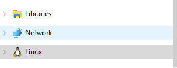
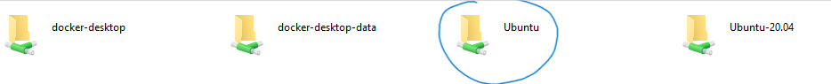
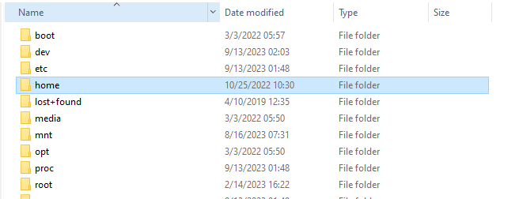
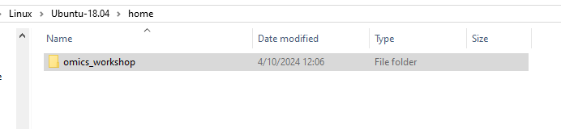
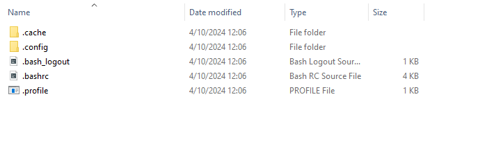

## Installation Manually

#### Windows Only - WSL2

Make sure that WSL2 is installed. In most current iterations of Windows 10/11, this should already be available. If not, run these steps:

Prerequisites: None

1. Open Windows Powershell and type `wsl --version`

If you have something appear you can skip this step, otherwise follow the instructions [here](https://docs.microsoft.com/en-us/windows/wsl/install-win10#step-4---download-the-linux-kernel-update-package)

2. `wsl --install -d ubuntu`
3. Go Back to powershell and type: `wsl.exe --set-default-version 2`

You may need to restart your machine after installing

:warning: please be aware that things in your `C:` drive will be referred to as `mnt/c/`. So, for instance if I want to put something in my `Documents` folder I would need to do `cp test.txt /mnt/c/Users/$USER/Documents/test.txt`. Make sure you select the right value of $USER in that path example. If you're unsure, simply check the username in Windows10 OR you can hit `tab` after `/mnt/c/Users/` and you should see things autopopulate`

Otherwise, if you want to view things through the File Explorer you can do so by following these steps:

##### Viewing or adding to your WSL from Windows Explorer

On the left-hand side, you should see the Linux logo in the quick search, near the bottom. Open Windows Explorer (Folder icon) on your Windows 10/11 machine first.



Make sure to select the Distro name. In my case (and yours) it is likely `Ubuntu`


Select `/home/`



Select the username. There is likely only a single directory within here. In my case, it is merribb1



You're now in the `$HOME` of your WSL2 terminal! feel free to browse around. We will access this this way when doing TaxTriage (see further down)



#### All Platforms

If you already have conda install you can skip this step.

1. Open WSL2 (Windows) or your local terminal. If in WSL2, you should open to your `$HOME` directory
2. [Miniconda3](https://docs.anaconda.com/free/miniconda/index.html) - Follow the steps here. Make sure to pick your operating system (Mac (arm/amd64), WSL2/Linux)

YOU WILL NOT SELECT WINDOWS FOR A WINDOWS MACHINE. You must select [Linux](https://repo.anaconda.com/miniconda/Miniconda3-latest-Linux-x86_64.sh) within your WSL2 terminal

3. Run the below commands to install 
   
```
mkdir -p ~/miniconda3
curl https://repo.anaconda.com/miniconda/Miniconda3-latest-MacOSX-arm64.sh -o ~/miniconda3/miniconda.sh
bash ~/miniconda3/miniconda.sh -b -u -p ~/miniconda3
rm -rf ~/miniconda3/miniconda.sh

```


#### Mac Only (after installing Conda). Skip if not using a Mac M1/2

If you use x86 architecture processors for Mac, you can skip this step. Otherwise, newer models use the M1/2 chip and require you to setup rosetta and an x86 environment to run things like conda. If you have a M1/2 Mac and have already done this process (setting up conda x86 env) you can skip this step as well.

1. Open a terminal
2. Type (you can copy this command)

```
export CONDA_SUBDIR=osx-64
```

You only need to run this if you have a Mac M1/2 and before you run the following installation step (Packages).

Resources:

1. [Issue on setting up x86 environment](https://github.com/conda-forge/miniforge/issues/165#issuecomment-860233092)

#### Packages

```
conda create -y -n omics_workshop bowtie2 minimap2 kraken2 krona fastqc samtools bcftools git python 
conda activate omics_workshop
```

Congratulations, you've completed the required installation steps for running things from the command line
